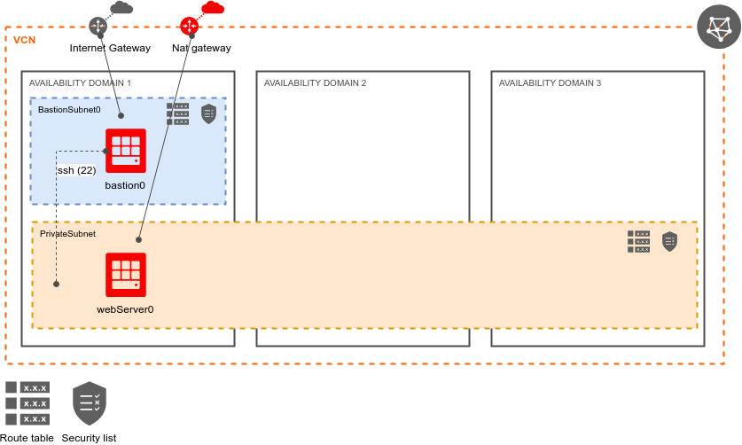
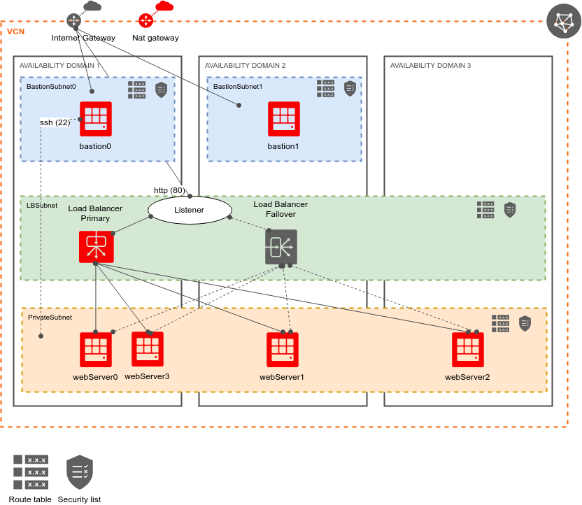
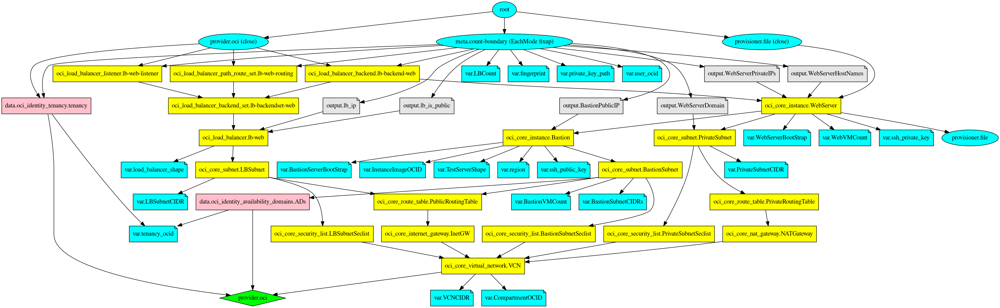

---
title: Introduction to Terraform using OCI
author: Vít Kotačka, Ladislav Dobiáš
...


# OCI & Terraform & Terratest

## Agenda

- Login to OCI console
- Prereqisities
- Setup OCI API key
- Today's Goals with Terraform
- Terraform - setup
- Terraform - first test
- Terraform - steps
- Terratest


## Login to OCI console

- OCI - Oracle Cloud Infrastructure
- console URL: [https://console.eu-frankfurt-1.oraclecloud.com/?tenant=czechedu2021](https://console.eu-frankfurt-1.oraclecloud.com/?tenant=czechedu2021)
    - user: email
    - password: generated, need to be changed on first login

- authorization:
    - every student is in one of `student*` groups
    - every group `student*` can:
        - do all in their compartment (same name as the group)
        - read all resources
        - (these policies would be too open for real production environment)

- quota:
    - important:
        - virtual machine shapes: 3x 15 VM.Standard2.1 (1 in each AD)
        - loadbalancers: 15 in region


## Prereqisities

All commands expect Unix or Linux environment. They will probably not work on Windows.

This you should have installed (can be in docker, too):

- curl
- git
- openssl
- terraform, e.g.:

    ```
    wget https://releases.hashicorp.com/terraform/0.15.3/terraform_0.15.3_linux_amd64.zip
    unzip terraform_0.15.3_linux_amd64.zip
    mv terraform ~/bin
    ```
- go 1.14+ (for terratest)

Optional (recommended - for OCI API key setup,...):

- python3

    ```
    sudo yum install python3
    ```

- oci cli - install OCI cli: [https://docs.cloud.oracle.com/iaas/Content/API/SDKDocs/cliinstall.htm](https://docs.cloud.oracle.com/iaas/Content/API/SDKDocs/cliinstall.htm)

    ```
    sudo pip3 install oci-cli
    ```

- jq (for json parsing)


## Setup OCI API key

- 3 possibilities:
    - just download it from your profile in OCI Console
    - using OCI cli - generate OCI API key to `~/.oci`:

        ```
        oci setup config
        ```

        - provide:
            - user OCID - get it from UI console
            - tenancy OCI (also from UI): `ocid1.tenancy.oc1..aaaaaaaah3b24zkkewpfygiw3rekqn3idilrt2qrjzkcdxbu5yhqpet4ox4a`
            - region: `eu-frankfurt-1`
    - manual way:
        - see [https://docs.cloud.oracle.com/iaas/Content/API/Concepts/apisigningkey.htm](https://docs.cloud.oracle.com/iaas/Content/API/Concepts/apisigningkey.htm)
- add the key via console UI: your user -> API Keys -> Add Public Key
  - paste the contents of `~/.oci/oci_api_key_public.pem` there and press Add
- simple tests using oci cli:

    ```
    oci iam region list
    oci compute image list --compartment-id ocid1.tenancy.oc1..aaaaaaaah3b24zkkewpfygiw3rekqn3idilrt2qrjzkcdxbu5yhqpet4ox4a
    ```

- example of using jq:

    ```
    oci compute image list --compartment-id ocid1.tenancy.oc1..aaaaaaaah3b24zkkewpfygiw3rekqn3idilrt2qrjzkcdxbu5yhqpet4ox4a --all \
      | jq -r '.data[]|"\(.id) \(."display-name")"'
    ```

## Goals with Terraform - simple webserver with bastion

Deployment diagram - simple:


This would be achieved at the step #6.

*Note*: there are some "mistakes" included in several steps. Find them and fix them.


## Goals with Terraform - more webservers with bastion and load balancer

Deployment diagram - with LB:


This would be achieved at the last step.


## Terraform - setup

- get sources:

    ```
    git clone https://github.com/ladaedu/oci-terraform-intro
    cd oci-terraform-intro/web-server
    ```

- edit variables in env-vars.example that are not commented out, copy it first (env-vars is in .git-ignore):

    ```
    cp env-vars.example env-vars
    ```

    - use data from `~/.oci/config`

- source it:

    ```
    . env-vars
    ```

## Terraform - first test

- list current `*.tf` files:

    ```
    ls *.tf
    ```

    - output (recommened to look inside the files): `network.tf  variables.tf`

- init terraform (download providers, modules,...):

    ```
    alias tf=terraform
    tf init
    ```

- plan

    ```
    tf plan
    ```

- apply

    ```
    tf apply
    ```


## Terraform - steps overview

0. VCN, gateways
1. Datasources - ADs, Tenancy
2. Bastion - network: routing table, seclist, subnet
3. Bastion VM
4. Private Subnet for Web servers - network: routing table, seclist, subnet
5. Web server
6. Outputs - IP addresses
7. Load balancer + add some web servers

## Terraform - next step

- rename next steps TF file, e.g. `*.tf1` to `*.tf`:

    ```
    orig=$(echo *1);link=${orig%?};echo ln -s $orig $link
    ```
- for other steps, replace `1` with next numbers

- plan

    ```
    tf plan
    ```

- apply

    ```
    tf apply
    ```
- check what was created in UI console


## Terraform - notes for step 7 - load balancer

- to add more web server nodes, increase variable WebVMCount for 1 to e.g. 4 in file variables.tf
- to add more bastion server nodes, increase variable BastionVMCount for 1 to e.g. 2 in file variables.tf
- to test loadbalancer:
    - from CLI:

        ```
        lb_address=$(tf output -json|jq -r .lb_ip.value[0])
        echo $lb_address
        curl http://$lb_address

        # check that round-robin works:
        for i in $(seq 10);do
            curl -s http://$lb_address
        done | grep name
        ```

- or get LB IP address from console UI (Networking/Load Balancers), and test it in browser - and reloads.


## Terratest

In [terraform_oci_test.go](terratest/terraform_oci_test.go), there are 4 small tests:

- ssh to bastion
- ssh to webserver (via bastion)
- check that webserver nginx port 80 is open using netstat
- check that webserver nginx returns status 200

Terratest will create its own environment, so destroy your environment first, to avoid problems with quota.
- destroy the deployment:

    ```
    tf destroy
    ```

- run terratest:

    ```
    cd terratest
    go test -v -run TestTerraform
    ```


## Thank you

Questions?


# Backup slides

## Terraform graph

- generate graph - using Graphviz:

    ```
    tf graph
    ```
- generate graph with colors:
    ```
    ./tf-graph.sh
    ```
Graph of dependencies of resources, variables, outputs:


## Initial tenancy setup

For creating initial groups, policies, compartments, users, a custom module `compartment-group-policy` was created, which reuses
standard OCI Terraform IAM modules - in `terraform-oci-iam` directory.

To run these TF script, you must be an administrator (and source correct env-vars file). Steps:
- create compartments, groups, policies:

    ```
    cd admin/groups
    tf init
    tf plan
    tf apply
    ```

- create users - define correct variables first, then run terraform:

    ```
    cd admin/users
    cat <<EOF > variables-users.tf
    variable "student1_name" { default = "first1.last1@email.cz" }
    variable "student2_name" { default = "first2.last2@email.cz" }
    EOF
    tf init
    tf plan
    tf apply
    ```
    - then "Create/Reset Password" must be done from console UI for each user


## References

- Terraform:
    - download: [https://www.terraform.io/downloads.html](https://www.terraform.io/downloads.html)
    - OCI provider docs: [https://www.terraform.io/docs/providers/oci/](https://www.terraform.io/docs/providers/oci/)
    - OCI provider sources and examples:  [https://github.com/terraform-providers/terraform-provider-oci](https://github.com/terraform-providers/terraform-provider-oci)
- OCI:
    - [Overview of Networking](https://docs.cloud.oracle.com/iaas/Content/Network/Concepts/overview.htm)
    - [Regions and Availability Domains](https://docs.cloud.oracle.com/iaas/Content/General/Concepts/regions.htm)
    - [list of regions](https://github.com/oracle/oci-python-sdk/blob/master/src/oci/regions.py#L89-L118) in OCI Python SDK (the line numbers can differ in future)
    - [Regional Subnets](https://docs.cloud.oracle.com/iaas/releasenotes/changes/08c01d20-c829-47f2-8d54-9e9958f50ba8/)
    - [Overview of Load Balancing](https://docs.cloud.oracle.com/iaas/Content/Balance/Concepts/balanceoverview.htm)
    - [OCI Terraform Modules for Identity and Access Management](https://registry.terraform.io/modules/oracle-terraform-modules/iam/oci/1.0.2)
    - OCI CLI sources: [https://github.com/oracle/oci-cli](https://github.com/oracle/oci-cli)

